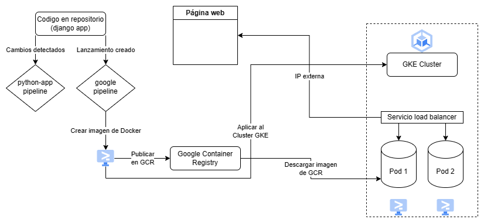

# Demo Devops Python

This is a simple application to be used in the technical test of DevOps.

## Diagram



## Getting Started

### Prerequisites

- Python 3.11.3

### Installation

Clone this repo.

```bash
git clone https://bitbucket.org/devsu/demo-devops-python.git
```

Setup virtual environment, install dependencies, and migrate the database:

```bash
make init
```

## Usage

To run tests and check coverage you can use this command:

```bash
make test
```

Static code analysis (linting) is performed with this command:

```bash
make lint
```

To build the docker image you can use this command:

```bash
docker-compose build
```

To run the project locally you can use this command:

```bash
docker-compose up
```

Open http://localhost:8000/api/ with your browser to see the result.

## Pipelines

There are two Github Actions pipelines for this project. The first one is located in `.github/workflows/python-app.yml` and is executed whenever a push is made to the main branch. It runs code tests and lints the code (static analysis). The second one is located in `.github/workflows/google.yml` and is executed whenever a new release is created on Github. It builds the docker image, pushes it to Google Container Registry, and deploys the application to Google Kubernetes Engine (GKE) on the Google Cloud Platform. This workflow makes use of repository secrets to store GCP credentials.

Kubernetes deployment information is located in `deployment.yaml`. It defines a deployment with 2 replicas, horizontal scaling and a load balancer service to expose the application to the internet and allocate requests to the pods.

A typical workflow for this project would be to push changes to the main branch to validate the code is passing tests and lints, then to create a release when the code is ready to be deployed to the cloud. I chose this structure, but a single pipeline could be used to achieve the same result.

### Features

These services can be performed:

#### Create User

To create a user, the endpoint **/api/users/** must be consumed with the following parameters:

```bash
  Method: POST
```

```json
{
    "dni": "dni",
    "name": "name"
}
```

If the response is successful, the service will return an HTTP Status 200 and a message with the following structure:

```json
{
    "id": 1,
    "dni": "dni",
    "name": "name"
}
```

If the response is unsuccessful, we will receive status 400 and the following message:

```json
{
    "detail": "error"
}
```

#### Get Users

To get all users, the endpoint **/api/users** must be consumed with the following parameters:

```bash
  Method: GET
```

If the response is successful, the service will return an HTTP Status 200 and a message with the following structure:

```json
[
    {
        "id": 1,
        "dni": "dni",
        "name": "name"
    }
]
```

#### Get User

To get an user, the endpoint **/api/users/<id>** must be consumed with the following parameters:

```bash
  Method: GET
```

If the response is successful, the service will return an HTTP Status 200 and a message with the following structure:

```json
{
    "id": 1,
    "dni": "dni",
    "name": "name"
}
```

If the user id does not exist, we will receive status 404 and the following message:

```json
{
    "detail": "Not found."
}
```

## License

Copyright © 2023 Devsu. All rights reserved.
